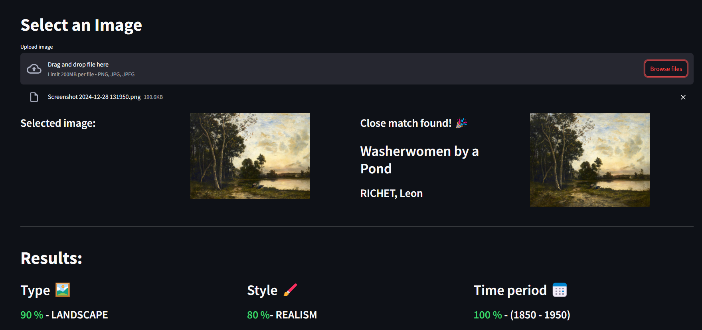

# ImageToVec encoder for proximity search.

## How to run ?

### From source (Faster and easier)

get source code 
> git clone https://github.com/Just-SM/ADL.git

in folder run 
> pip install -r requirements.txt

start server
> streamlit run streamlit_app.py

Web is hosted on http://localhost:8501

### Docker 

get source code 
> git clone https://github.com/Just-SM/ADL.git

run
> docker compose up --build

## Source code and Details
For details and source code visit [dev branch](https://github.com/Just-SM/ADL/tree/dev)

## Topic 

### *Computer Vision* 🤖

Image encoding to vector space.

## Project description

### Idea 🖼️
The core idea is to encode the image to a vector space for future proximity search and clustering.

In particular, I am interested in painting. Imagine painting something and then finding out which style, years, school, or authors it is most similar to.

### Model and Techniques 🔧
The current plan is to fine-tune CNN with Contrast learning techniques to create an Image encoder. Later, NN algorithm is used to search for similar paintings. Final results of clarification resolved by majority voting of neighbors.

### Data 💾
Data will be collected (scrapped) from the [Web Gallery of Art](https://www.wga.hu/index.html), which has approximately 50,000 art pieces and 6,000 authors. Of course, some additional sources might be considered.

## Project type 

### *Hybrid*
Combination of **Bring your data** and **Bring your method**.

## Reference papers 📃:
- [SimCLR. A Simple Framework for Contrastive Learning of Visual Representations.](https://arxiv.org/abs/2002.05709)
- [Clustering-based Contrastive Learning for Improving Face Representations](https://arxiv.org/pdf/2004.02195)
- [Locality-Sensitive Hashing for Finding Nearest Neighbors](https://ieeexplore.ieee.org/abstract/document/4472264)
- ...
