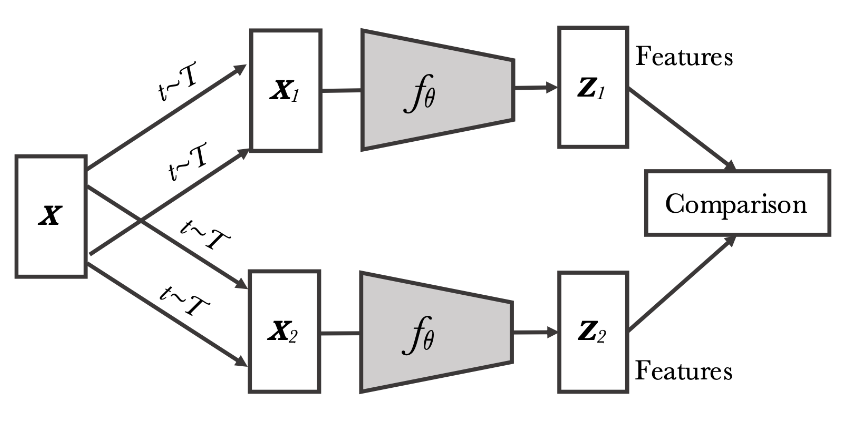
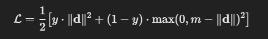
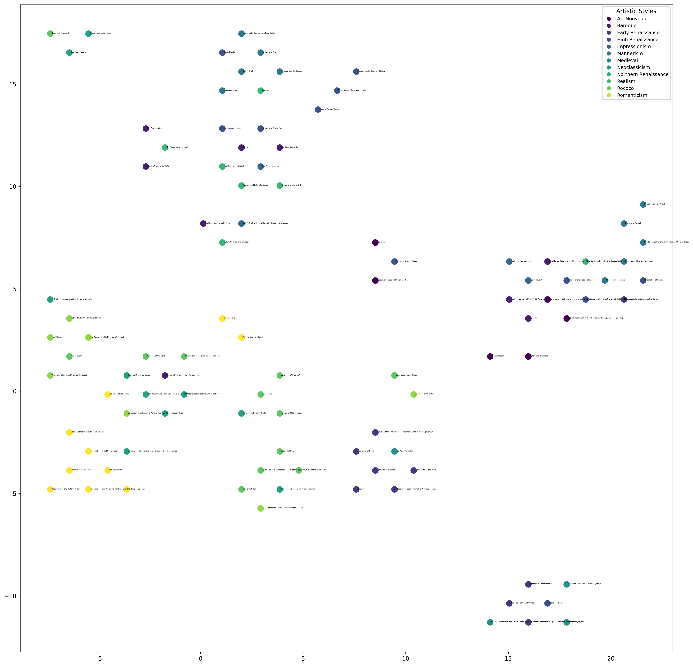

# ImageToVec encoder for proximity search.

## Reference papers 📃:
- [SimCLR. A Simple Framework for Contrastive Learning of Visual Representations.](https://arxiv.org/abs/2002.05709)
- [Clustering-based Contrastive Learning for Improving Face Representations](https://arxiv.org/pdf/2004.02195)
- [Locality-Sensitive Hashing for Finding Nearest Neighbors](https://ieeexplore.ieee.org/abstract/document/4472264)
- ...

## Topic 

### *Computer Vision* 🤖

Image encoding to vector space.

## Project type 

### *Hybrid*
Combination of **Bring your data** and **Bring your method**.

## Project description

### Idea 🖼️
The core idea is to encode the image to a vector space for future proximity search and clustering.

In particular, I am interested in painting. Imagine painting something and then finding out which style, years, school, or authors it is most similar to.

### Model and Techniques 🔧
The current plan is to train/fine-tune CNN with Contrast learning techniques to create an Image encoder. Later, some locality approximation algorithms will be used to optimize search and clustering.

### Data 💾
Data will be collected (scrapped) from the [Web Gallery of Art](https://www.wga.hu/index.html), which has approximately 50,000 art pieces and 6,000 authors. Of course, some additional sources might be considered.

## Plan of Work 📅

- Additional research on the topic (~4 hours)
- Data collection scripts and verification  (~5 hours)
- Small model creation (~3? hours)
- Small model testing (~30 min)
- Pipeline creation (~1 hours)
- Model training ( ?0 hours )
- Proof of concept testing (~30 min)
- Web dashboard interface (~4 hours)

# Phase 1 Results

Progress :

- Data Scraping ✅
- Images Scraping ✅
- Data Preprocessing ✅
- Train Indexes Pre-computation ✅
- Pipeline base model ✅
- Basic embedding modeling ✅
- Base tests and Approximation algorithms for search ❌
- Full model train and test ❌
- UI application ❌

## Details 

>❗
> THE **FULL INDEXES** files ARE **NOT UPDATED** (GIT  size limitation).

### Data Scraping

Deliverables:

>/data (Retrieved data)

>/data_mining (Notebooks)

As mentioned in the task description, the data is scraped from [Web Gallery of Art](https://www.wga.hu/index.html)

DataScraping.ipynb Is collecting the Artist (style, name, period ... ) data and combines it with art pieces data(img_catalog.txt) collected from website. Additionally basic data transformation is done.

### Data Scraping

Deliverables:

>/image_data (Retrieved data)

>/data_mining (Notebooks)

DataScraping.ipynb Is downloading images. Broken links are removed.

### Train Indexes Pre-computation

Deliverables:

>/indexes_data (Retrieved data)

>/Create_full_test_set.ipynb
>/Create_mini_test_set.ipynb

The full data set considers:

Each image has school type and style, as characteristics. For training purposes, each image (anchor) contains a set of all Ideal positive examples and all set of Ideal negative examples. Ideal means (**full** characteristics match or not match). 

For efficiency, the data is split into groups(f.e. French - Impressionism - Landscape ) as all of this group will have the same negative and positive examples.

The mini data (used for evaluation and as a test) considers only one characteristic (style (as the most difficult)). Everything is the same.

### Pipeline base model

>/model (Trained model)

>/BaseLine_pipe.ipynb 

The basic model can be represented as follows:

Where the x1 and x2 are images. (Anchor and positive or negative example)

f0 is the CNN model.

Features are Fully connected layers, that are being trained.

Comparison is a Contrastive loss function.

For the data, a custom dataset and dataloader are created.

For the base model, the pre-trained 

>ShuffleNet_V2_X1

was used as lightweight CNN layers for feature extraction.

### Model modification

For the training purposed the CNN layers are frozen and the last clarification layers are replaced with dense layers.

### Basic embedding modeling

>/Show_Embeddings.ipynb

>/space.png

The notebook uses the trained baseline model for creating basic embeddings for a small subset of mini_test_set.

The embedding is later projected to 2d space with UMAP and displayed on the graph.

One can observe that the Model is creating some more-less meaningful clusters.

### Results

The small test model showed a marginal difference in "pairwise" distance to positive and negative items. Unfortunately, there is no much sense in a complete test as the data was represented by just a fraction with a super light model.

### Time spent📅

- Additional research on the topic (3 hours)
- Data collection scripts and verification  (6 hours)
- Small model creation (1 hour)
- Small model testing (3 hours)
- Pipeline creation (4 hours)

  

